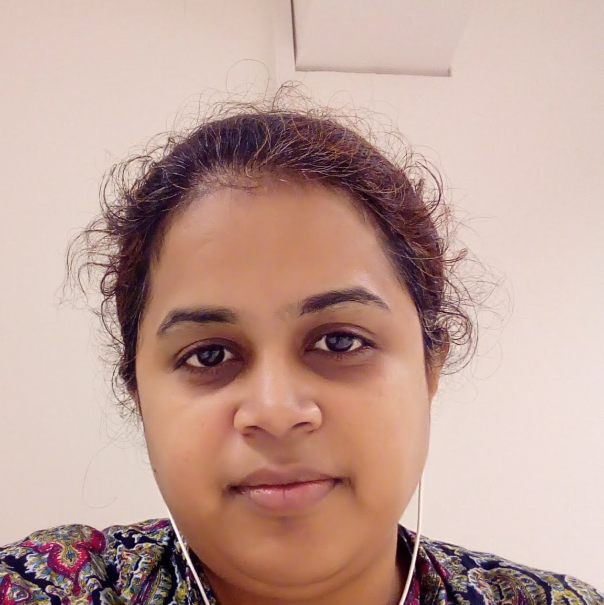

&nbsp;&nbsp;&nbsp;&nbsp;&nbsp;&nbsp;Assistant Professor 
&nbsp;&nbsp;&nbsp;&nbsp;&nbsp;&nbsp;Image and Vision Computing Lab 
&nbsp;&nbsp;&nbsp;&nbsp;&nbsp;&nbsp;Optimization and Machine Learning Lab 
&nbsp;&nbsp;&nbsp;&nbsp;&nbsp;&nbsp;IIITMK 
&nbsp;&nbsp;&nbsp;&nbsp;&nbsp;&nbsp;Techno park Campus 
&nbsp;&nbsp;&nbsp;&nbsp;&nbsp;&nbsp;Trivandrum 
&nbsp;&nbsp;&nbsp;&nbsp;&nbsp;&nbsp;Kerala  
&nbsp;&nbsp;&nbsp;&nbsp;&nbsp;&nbsp;India-695581  
&nbsp;&nbsp;&nbsp;&nbsp;&nbsp;&nbsp;firstname dot lastname at iiitmk dot ac dot in  
  

## Research Interests
* [Computer Vision](https://en.wikipedia.org/wiki/Computer_vision)
* [Multimedia](https://en.wikipedia.org/wiki/Multimedia) [Signal Processing](https://en.wikipedia.org/wiki/Signal_processing)
* [Bayesian Optimization](https://en.wikipedia.org/wiki/Bayesian_optimization) for Industrial Applications
* [Machine Learning](https://en.wikipedia.org/wiki/Machine_learning)  

## News
* [Feb 2020] Joined as a Assistant Professor at IIITMK, India. 

  

<small>Successful and unsuccessful people do not vary greatly in their abilities.They vary in their desires to reach their potential. – John Maxwell </small>

