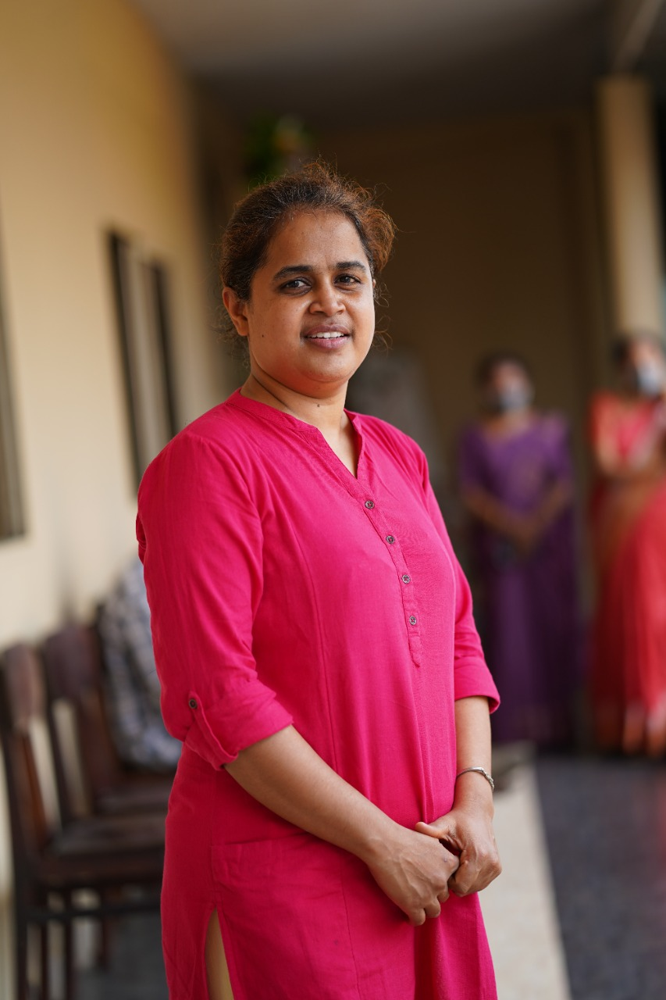

&nbsp;&nbsp;&nbsp;&nbsp;&nbsp;&nbsp;Assistant Professor Grade-I 
&nbsp;&nbsp;&nbsp;&nbsp;&nbsp;&nbsp;[Image and Vision Computing Lab](https://sinnuthomas.github.io/IVC/) 
&nbsp;&nbsp;&nbsp;&nbsp;&nbsp;&nbsp;[Optimization and Machine Learning Lab](https://sinnuthomas.github.io/OML/) 
&nbsp;&nbsp;&nbsp;&nbsp;&nbsp;&nbsp;Digital University Kerala (formerly IIITM-Kerala) 
&nbsp;&nbsp;&nbsp;&nbsp;&nbsp;&nbsp;Technopark Phase IV, Mangalapuram 
&nbsp;&nbsp;&nbsp;&nbsp;&nbsp;&nbsp;PO Thonnakkal,Thiruvananthapuram  
&nbsp;&nbsp;&nbsp;&nbsp;&nbsp;&nbsp;Kerala 695 317 India   
&nbsp;&nbsp;&nbsp;&nbsp;&nbsp;&nbsp;+91-471-2788000  
&nbsp;&nbsp;&nbsp;&nbsp;&nbsp;&nbsp;firstname dot lastname at duk dot ac dot in  
  

## Research Interests
* [Computer Vision](https://en.wikipedia.org/wiki/Computer_vision)
* [Image](https://en.wikipedia.org/wiki/Digital_image_processing) / [Video Signal Processing](https://en.wikipedia.org/wiki/Video_processing)
* [Optimization Techniques](https://en.wikipedia.org/wiki/Mathematical_optimization)
* [Machine](https://en.wikipedia.org/wiki/Machine_learning) / [Deep](https://en.wikipedia.org/wiki/Deep_learning) /  [Reinforcement](https://en.wikipedia.org/wiki/Reinforcement_learning) Learning  

## News

* [Oct 2025] Congrats 
    Congrats Archana Vijayan, PhD Scholar for the new role as faculty in Kerala Publice Service Commission.
  
* [Aug 2025] Welcome 
    Welcome Sanjay M S to the Group as Research Scholar.
  
  
  

<small>Service and Significance is Success. – Oprah Winfrey </small>

